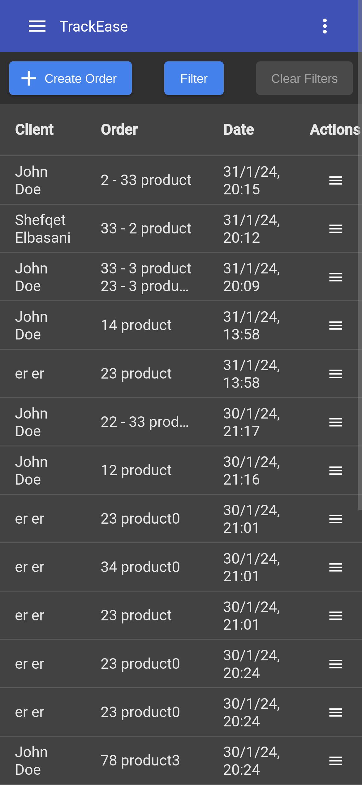

# :zap: Product Delivery

* This app was generated with [Angular CLI](https://github.com/angular/angular-cli) version 15.2.9.
* This is a simple CRM app with standard pages for Users list, Product list, Orders list that are all paginated and aditional pages such as Profile, Home and Settings.
* To be upgraded to newer versions of Angular.

## :page_facing_up: Table of contents

* [:zap: Product Delivery](#zap-angular-form-validation)
  * [:books: General info](#books-general-info)
  * [:camera: Screenshots](#camera-screenshots)
  * [:signal_strength: Technologies](#signal_strength-technologies)
  * [:floppy_disk: Setup](#floppy_disk-setup)
  * [:computer: Code Examples](#computer-code-examples)
  * [:cool: Features](#cool-features)
  * [:clipboard: Status & To-Do List](#clipboard-status--to-do-list)
  <!-- * [:file_folder: License](#file_folder-license) -->
  * [:envelope: Contact](#envelope-contact)

## :books: General info

* Helps businesses in placing orders, generating PDF lists of orders, monitoring deliveries, and tracking sales reports, all within a fully responsive web interface.

## :camera: Screenshots

<div style="display: grid; grid-template-columns: repeat(auto-fill, minmax(200px, 1fr)); gap: 16px;">
    
    
    
    
    
    
</div>

## :signal_strength: Technologies

* [Angular v15](https://angular.io/)
* [Angular Material](https://v15.material.angular.io/)
* [PlotlyJS](https://plotly.com/javascript/)

## :floppy_disk: Setup

* git clone `https://github.com/ermalCerhozi/productDeliveryFE.git`.
* Switch to the specific version of Node.js `nvm use`.
* Install dependencies using `yarn install`.
* Run `ng serve`.
* Navigate to `http://localhost:4200/`. The app will automatically reload if you change any of the source files.

### Run with Docker

* Ensure the backend containers are running and reachable on `http://localhost:3000` (see the backend project for instructions).
* From the `productDeliveryFE` directory build and start the frontend container:

    ```powershell
    docker compose up --build
    ```

* Open `http://localhost:4200` in your browser. Port `4200` on the host maps to port `80` inside the container, so the Angular build is served by Nginx and remains reachable outside Docker.
* The production build bundled in the container calls the backend at `http://host.docker.internal:3000`. Adjust `src/environments/environment.prod.ts` if your backend runs elsewhere.

## :computer: Code Examples

* Dedicated dialogs for managing products and users, each exposing focused inputs and outputs for create/update flows.

```typescript
@ViewChild('createProductDialog')
private createProductDialog!: TemplateRef<CreateUpdateProductDialogComponent>

<ng-template #createProductDialog>
    <app-create-update-product-dialog
        [action]="actionState!"
        [product]="activeProduct!"
        (updateProduct)="updateProduct($event)"
        (createProduct)="createProduct($event)"
    ></app-create-update-product-dialog>
</ng-template>

<ng-template #createUserDialog>
    <app-create-update-user-dialog
        [action]="actionState"
        [user]="activeUser"
        (updateUser)="updateUser($event)"
        (createUser)="createUser($event)"
    ></app-create-update-user-dialog>
</ng-template>
```

## :cool: Features

* Dark Mode.
* Slider password strength indicator.
* Sales reports with graps.

## :clipboard: Status & To-Do List

* Status: Working.
* To-Do: Translations, analytics.

<!-- ## :file_folder: License

* This project is licensed under the terms of the MIT license. -->

## :envelope: Contact

* Repo created by [Ermal Cerhozi](https://github.com/ermalCerhozi), email: ermal.cerhozi3@gmail.com