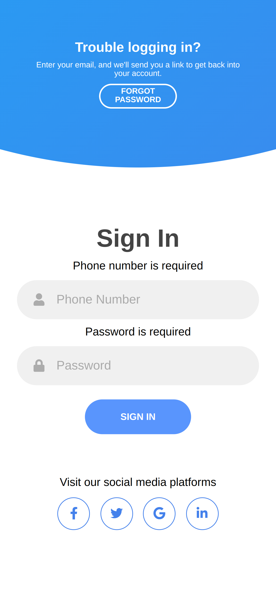

# product Delivery

This project was generated with [Angular CLI](https://github.com/angular/angular-cli) version 14.0.2.

## Development server

Run `ng serve` for a dev server. Navigate to `http://localhost:4200/`. The application will automatically reload if you change any of the source files.

## Build

Run `ng build` to build the project. The build artifacts will be stored in the `dist/` directory.

## With NEST JS back-end

[Product Delivery BE](https://github.com/ermalCerhozi/productDeliveryBE)

## Flow for User Login and usage

